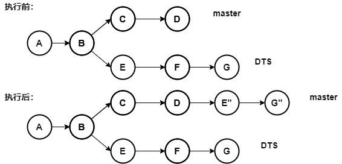

::: tip 主要作用
操作提交，主要作用就是分支之间遴选提交，进行分支之间的部分代码合并
:::

## 语法

```bash
git cherry-pick [--edit] [-n] [-m parent-number] [-s] [-x] [--ff]
                  [-S[<keyid>]] <commit>…​
git cherry-pick (--continue | --skip | --abort | --quit)
```

## 常用的参数

| 参数             | 解释                  |
|:-------------- |:------------------- |
| --continue     | 遇到冲突，处理完继续遴选        |
| --skip         | 放弃当前冲突处理，跳过，继续处理后边的 |
| --quit         | 跳过当前冲突的处理，继续遴选      |
| --abort        | 放弃当前冲突的处理，直接跳出      |
| -n,--no-commit | 手动处理，而不是自动处理，不推荐    |

::: warning 提示

- 在遴选多个提交的时候，建议顺序按照时间先后降序排序，即提交晚的在最前，有利于减少冲突的产生

:::

## 常用命令举例：

- 遴选某个提交到当前分支
  
  ```bash
  git git_cherry-pick 765461f9a0
  ```

- 遴选一段提交到当前分支
  
  ```bash
  git git_cherry-pick 765461f9a0..3a20bf181a548
  ```

- 遴选多个提交
  
  ```bash
  git cherry-pick 3a20bf181a5483c 765461f9a0..3a20bf181a548
  ```

## 详细介绍

示意图：



- 遴选的结果类似于rebase

- cherry-pick的实质就是将一个或者多个提交合并到目标分支，合并的过程按照参数顺序一个个的合并。

- 如果遇到冲突，遴选会停下来，需要处理完成当前冲突以后，才能继续遴选。

- 可以处理一个提交，也可以处理一段提交。

## 处理冲突

遇到冲突，处理冲突内容的方式都是类似的

最终需要将代码添加到暂存区以后，继续当前的遴选进程。

```bash
## 将代码添加到暂存区
git add .
## 继续遴选
git cherry-pick --continue
```
